# Happiness Prediction with Kafka Streaming, Linear Regression & Dash


---

## Objective

Build a **real-time ETL and Machine Learning system** that streams data through **Apache Kafka**, performs **Multiple Linear Regression** predictions of *Happiness Score*, stores the results in **MySQL**, and visualizes key performance indicators (KPIs) through an interactive **Dash dashboard**.

---

## System Architecture

```mermaid
flowchart LR
    A[CSV files 2015–2019] --> B[Producer.py\nExtract + Transform + Split flag]
    B --> C[(Kafka topic: happiness-data)]
    C --> D[Consumer.py\nLoad .pkl → Predict → Insert]
    D --> E[(MySQL database: happiness_db / predictions)]
    E --> F[Dash App\nKPIs + Maps + Trends]
```



---

## Repository Structure

```
├─ data/
│  ├─ clean/
│  │  ├─ 2015.csv … 2019.csv
│  │  └─ happiness_all.csv              # (optional, if you export it)
├─ kafka/
│  ├─ producer.py                        # ETL + stream to Kafka
│  └─ consumer.py                        # Predict + load to MySQL
├─ model/
│  └─ happiness_regression.pkl           # Trained sklearn model
├─ notebooks/
│  ├─ 1_pre_EDA.ipynb
│  ├─ 2_transformation.ipynb
│  ├─ 3_post_EDA.ipynb
│  ├─ 4_regression_models.ipynb
│  └─ 5_train_model.ipynb               # Final training + export .pkl
├─ dashboard/
│  └─ happiness_dashboard.py             # Dash app (Plotly)
├─ docker-compose.yml                    # (optional) if you containerize
├─ requirements.txt
└─ README.md
```

---

## Project Description

This repository implements a **complete data pipeline** that integrates **ETL, streaming, model inference, and visualization** for the *World Happiness Report (2015–2019)* dataset.

* The **Kafka Producer** extracts and cleans data, maps regions, standardizes columns, and flags each record as *train* or *test* before sending it to the topic `happiness-data`.
* The **Kafka Consumer** receives each record, loads the serialized regression model (`.pkl`), performs predictions, and inserts the results into **MySQL** (`happiness_db.predictions`).
* The **Dash Dashboard** connects to MySQL and displays KPIs, error distributions, scatter comparisons, temporal evolution, regional and geospatial analyses.

---

## Model & Features

**Model:** Multiple Linear Regression (scikit-learn)

**Target:** `Happiness_Score`
**Input Features:**

1. GDP per Capita
2. Social Support
3. Healthy Life Expectancy
4. Freedom
5. Generosity
6. Perceptions of Corruption

**Split:** 70 % training, 30 % testing (seed = 42)

**Metrics Evaluated:**

* R² (Coefficient of Determination)
* MAE (Mean Absolute Error)
* RMSE (Root Mean Squared Error)

---

## Why not RandomForest?

Although **RandomForestRegressor** achieved slightly higher raw accuracy, it was not selected because:

* The course emphasizes **interpretability** and understanding regression assumptions.
* Linear Regression offers **transparent coefficients** for each feature.
* It has **instant training and inference** — ideal for real-time streaming.
* RandomForest adds complexity, latency, and less explainability.

Thus, the chosen approach favors **clarity and generalization** over marginal accuracy gains.

---

## Key Technical Decisions

* **Streaming with Kafka:** enables asynchronous data flow between ETL (producer) and prediction (consumer).
* **MySQL as persistent layer:** relational, queryable, and easily visualized.
* **Model serialization (`.pkl`):** guarantees identical behavior between training and production.
* **Standardization with `StandardScaler`:** ensures features are on comparable scales.
* **Train/Test consistency:** same random state used across the notebook and streaming components.

---

## Database Schema

| Column                                                                                                              | Description               |
| ------------------------------------------------------------------------------------------------------------------- | ------------------------- |
| `country`, `region`                                                                                                 | Country and region name   |
| `year`                                                                                                              | Year (2015–2019)          |
| `gdp_per_capita`, `social_support`, `healthy_life_expectancy`, `freedom`, `generosity`, `perceptions_of_corruption` | Input features            |
| `actual_happiness_score`                                                                                            | Real value (from dataset) |
| `predicted_happiness_score`                                                                                         | Model output              |
| `prediction_error`                                                                                                  | `abs(actual − predicted)` |
| `data_split`                                                                                                        | `train` or `test`         |
| `created_at`                                                                                                        | Timestamp of insertion    |

---

## Dashboard Highlights

The **Dash application** connects directly to MySQL and updates interactively with filters for dataset, region, and year.

**KPIs:**

* Global R², MAE, RMSE
* Train vs Test record counts and metrics

**Visuals:**

* **Predicted vs Actual Scatter** with diagonal reference line
* **Error Distribution Histogram** with MAE vertical line
* **Train vs Test Comparison Bars** (MAE & RMSE)
* **Top-10 Largest Errors**
* **Performance by Region:** MAE + R² per region
* **World Map (Choropleth):** average MAE per country
* **Temporal Evolution:** yearly MAE and average Happiness Scores

📸 *Sample Screenshots:*


---

## Model Interpretation (Short Summary)

* Global performance: **R² ≈ 0.76**, **MAE ≈ 0.43** on a 0–10 scale.
* Train/Test metrics are balanced → model generalizes well.
* **Western Europe** and **Oceania** show the best fit (low MAE, high R²).
* **Sub-Saharan Africa** and **Latin America** show higher errors → non-linear or missing drivers.
* Temporal trends indicate stable predictions over the 2015–2019 period.

---

## Quickstart

```bash
# 1) Create and activate virtual environment
python -m venv .venv
source .venv/bin/activate       # (Windows: .venv\Scripts\activate)

# 2) Install dependencies
pip install -r requirements.txt

# 3) Start Kafka (Docker optional)
docker-compose up -d            # starts Kafka + ZooKeeper

# 4) Run consumer (first) and producer
python kafka/consumer.py
python kafka/producer.py

# 5) Launch the dashboard
python dashboard/happiness_dashboard.py
# → http://127.0.0.1:8050
```

---

## Environment Variables

```bash
# MySQL connection
DB_HOST=localhost
DB_PORT=3306
DB_USER=root
DB_PASSWORD=root
DB_NAME=happiness_db
```

Kafka broker defaults to `localhost:9092`, topic name `happiness-data`.

---

## Troubleshooting

| Problem                              | Likely Cause / Fix                                                              |
| ------------------------------------ | ------------------------------------------------------------------------------- |
| **Kafka connection refused**         | Ensure broker is running at `localhost:9092` and topic `happiness-data` exists. |
| **No data in dashboard**             | Confirm `consumer.py` inserted rows into `predictions`.                         |
| **MySQL authentication error**       | Verify DB credentials or running service.                                       |
| **World map missing some countries** | Adjust name normalization to match Plotly’s country list.                       |
| **Unicode error on console**         | Run scripts with UTF-8 encoding (`PYTHONUTF8=1`).                               |

---

## Results Summary

|   Metric | Train | Test |
| -------: | ----: | ---: |
|   **R²** |  0.78 | 0.75 |
|  **MAE** |  0.42 | 0.45 |
| **RMSE** |  0.54 | 0.56 |

*(values approximate, from the dashboard and model notebook)*

---

## Key Takeaways

* Linear Regression performs reliably across multiple years of the World Happiness dataset.
* The model generalizes well, with consistent test metrics and no overfitting.
* Regional variability reveals the influence of unobserved cultural or political factors.
* Real-time streaming integration ensures scalability and reusability for future predictive pipelines.

---

## References

* [World Happiness Report](https://worldhappiness.report/)
* [Apache Kafka Documentation](https://kafka.apache.org/documentation/)
* [MySQL Documentation](https://dev.mysql.com/doc/)
* [Scikit-Learn](https://scikit-learn.org/stable/)
* [Plotly & Dash](https://plotly.com/dash/)

---

## Author

**Fabián Gomezcasseres**
Data Engineering & AI – ETL Workshop 3
Universidad Autónoma de Occidente – 2025
